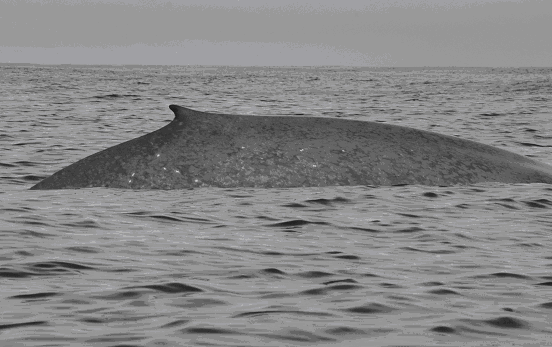

Blue whale vocalizations are low-frequency and can travel great distances in the ocean; blue whale song varies geographically, and these sounds may be useful for discriminating and monitoring different populations.

## N Pacific Blue Whales

::::: columns
::: {.column width="40%"}
Blue whales have been sighted throughout the North Pacific Ocean, with two geographically distinct blue whale call types: Northwestern and Northeastern Pacific blue whale calls. While both calls have been well documented throughout the North Pacific Ocean, prior to our report the western calls had never been visually linked to a blue whales.

In this study, sonobuoys were deployed in the presence of sighted blue whales as well as at select locations along the Aleutian Island chain. Type I, II, and V vocalizations were recorded in the presence of a blue whale sighted on 19 August 2024.

These data provide additional information on the distribution of blue whales throughout these waters as well as a confirmation of sounds previously attributed to northwestern blue whales.
:::

::: {.column width="60%"}
{width="336"}

{width="336"}

{width="339"}
:::
:::::

\[Link to Marine Mammal Publication\](<https://doi.org/10.1111/j.1748-7692.2006.00054.x>)

## ETP Blue Whales
