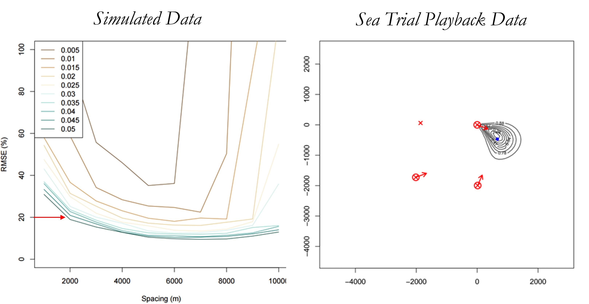
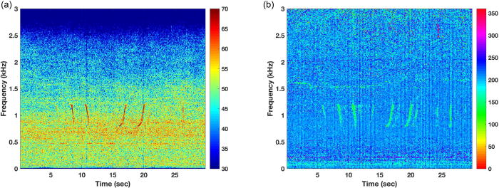
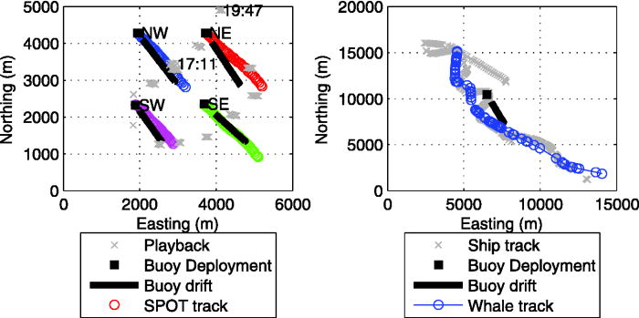

## Field Methods

Sonobuoys are expendable drifting recorders housed in a compact cylinder
for deployment from ships or airplanes. When the buoys are deployed, the
hydrophone drops to a pre-determined depth and a float inflates at the
surface. The multi-plexed signal containing the audio and DIFAR
information is transmitted from an antenna embedded in the float; this
signal can be received using a VHF receiver. Specialized receivers are
required to obtain the full low-frequency audio, and specialized
software is required to demultiplex the DIFAR signal. Field methods have
evolved over the years from analog to digital formats (sonobuoy
guidelines for select years can be found in the repository [supplement
folder](https://github.com/SAEL-SWFSC/SWFSC-PAM-Sonobuoys/tree/main/supplement)),
and [Rankin et al.
(2019)](https://repository.library.noaa.gov/view/noaa/20265) provides
detailed information on using sonobuoys for ceteacean surveys based on
decades of research.

## Analysis Methods

Most sonobuoys were monitored in real-time by field researchers, and
field notes can be found in the [fieldNotes
folder](https://github.com/SAEL-SWFSC/SWFSC-PAM-Sonobuoys/tree/main/supplement/fieldNotes)
in the SWFSC-PAM-Sonobuoy github repository.

Select sonobuoy deployments were analyzed for publications, where
specific methods are outlined in each publication (see
[publications](https://sael-swfsc.github.io/SWFSC-PAM-Sonobuoys/content/publications.html))

A standardized review of select sonobuoy is ongoing, as time allows.
Analog sonobuoy recordings were digitized by playing back analog
recordings through a Soundblaster Extigy sound card to a computer using
RavenPro (48kHz sample rate, 16-bit, 10 min file size). Not all analog
recordings were digitized; a list of digitized recordings can be found
here (**LINK**). Digitized recordings (wav files) are reviewed in
RavenPro. Recordings are scanned twice to better monitor at mid- and
low-frequencies.

### *Standardized Review*

Audio files were decimated using
\[Triton\](https://github.com/MarineBioAcousticsRC/Triton) v1.93 at 10x
and and 100x, giving 4800 Hz and 480 Hz decimated sample rate,
respectively. Data were reviewed at both of these decimation rates for
DIFAR buoys, and an additional review at full bandwidth (48 kHz) was
conducted for omni directional recordings from so

For mid-frequency review, recordings decimated to 4800 Hz were reviewed
using RavenPro Software (v1.6.4). Page size = 60 seconds, 90% increment,
10% step increment. View only spectrogram (not waveform), 2 rows with
512 FFT with 200 Hz to 2400 Hz in window.

-   ***Identify Start and End of recordings.*** For each START (either
    at the beginning, or after a bout of noise where I selected to END),
    create a box where the START of the box lies on the noise. Annotate
    start_end as 'start' and NA for others. For each END (either at the
    end of a good bout of recording or the end of the entire recording),
    create a box where the end of the box lies on the end of the good
    recording (note: the end of a good recording can also identify the
    start of bad noise). If this is the end of a recording, then label
    the other annotations as "NA". If this is the end of a good
    recording but start of noise, label the detection as "noise" and the
    quality as NA.

-   ***Detection of Sounds.*** Biological sounds were annotated in
    Raven.

## Playback Experiment and Methods Development

In 2016, SWFSC conducted a playback experiment for the purpose of
estimating the precision and accuracy of bearing angle estimation. This
was part of a larger Navy-funded project to investigate the potential
for using sonobuoys as a tool to estimate cetacean density in offshore
waters ([Rankin et al.
2017](https://github.com/SAEL-SWFSC/SWFSC-PAM-Sonobuoys/tree/main/supplement/Rankin_SBFinalReport_Rep2017.pdf)).
This data has been useful for methods development on several projects,
and this data is publicly available for future projects ([Link to NCEI
Data Portal](https://doi.org/10.25921/s2dw-2h15)).

### Acoustic Spatial Capture Recapture

{width="309"}

SWFSC collaborated with [Ben Stevenson (University of
Aukland)](https://profiles.auckland.ac.nz/ben-stevenson/about) to
evaluate the potential use of Acoustic Spatial Capture Recapture (ASCR)
methods to estimate call density across clustered sonobuoys. While a
simulation suggested these methods should be feasible, application to
real data identified a number of complications and errors that precluded
adoption of ASCR for these cases. Links to summaries of the [sonobuoy
SCR
models](https://github.com/SAEL-SWFSC/SWFSC-PAM-Sonobuoys/tree/main/supplement/stevenson_SCRsonobuoys_summary2017.pdf)
and [application to real
data](https://github.com/SAEL-SWFSC/SWFSC-PAM-Sonobuoys/tree/main/supplement/stevenson_SCRcalcurceas_summary2017.pdf).

#### Azigram Displays for DIFAR Sonobuoys

{width="315"}

As part of a larger methods paper led by [Aaron Thode (Scripps
Institution of Oceanography)](https://athode.scrippsprofiles.ucsd.edu/),
this playback data provided a means of testing the capabilities of using
Azigrams to enhance the accuracy of bearing measurements of weak
frequency-modulated signals. See [Thode et al.
2019](https://pubs.aip.org/asa/jasa/article/146/1/95/997205) for more
information.

### Estimating Sonobuoy Drift

{width="308"}

We attached GPS to each of the four sonobuoys during the playback
experiment, which provided high resolution tracking. This data provided
a valuable dataset to test new methods for estimating sonobuoy drift
developed by [Brian Miller of the Australian Marine Mammal
Center](https://www.marinemammals.gov.au/about/staff-and-students/brian-miller/).
See [Miller et al.
2018](https://pubs.aip.org/asa/jasa/article/143/1/EL25/616424) for more
information.
